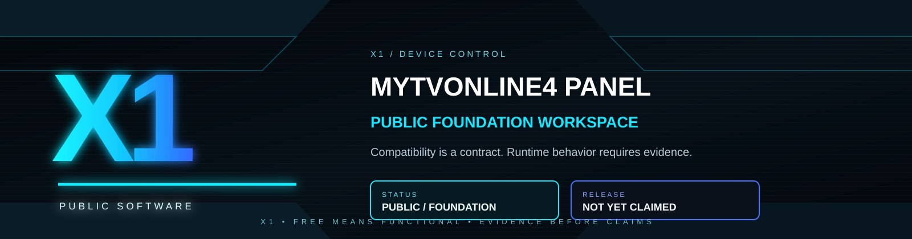
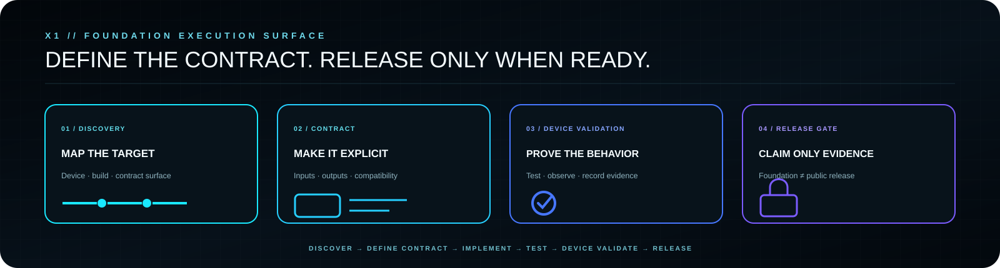

  <strong>PUBLIC · FOUNDATION · NOT YET RELEASED</strong> 
  Reserved X1 public workspace for compatible device-control tooling.

  <a href="https://x1panelhq.com"><strong>WEBSITE</strong></a>
  &nbsp;·&nbsp;
  <a href="https://forum.x1panelhq.com"><strong>FORUM</strong></a>
  &nbsp;·&nbsp;
  <a href="https://discord.gg/vSSw6jHmw"><strong>DISCORD</strong></a>
  &nbsp;·&nbsp;
  <a href="https://t.me/+XkuQS_QuD6g4Nzc0"><strong>TELEGRAM</strong></a>

---

## X1 MYTVOnline4 Panel

This repository is currently a **public foundation workspace**. It does not yet contain a production release and does not claim runtime compatibility merely because the repository exists.

The intended direction is X1 control tooling for compatible MYTVOnline4-oriented workflows, developed with explicit compatibility contracts, clear operator responsibility and evidence-based runtime claims.

---

## Planned engineering principles

- public software should be useful when it is actually released;
- compatibility must be validated against exact target devices/builds;
- configuration state is not the same as observed device behavior;
- operator and content authorization boundaries remain explicit;
- no credentials, customer data or private X1 implementation details belong in the public repository;
- release claims require source, test and runtime evidence appropriate to the claim.

---

## Control loop

`DISCOVER → DEFINE CONTRACT → IMPLEMENT → TEST → DEVICE VALIDATE → RELEASE`

**REPOSITORY PRESENT ≠ IMPLEMENTED ≠ RELEASED ≠ RUNTIME VERIFIED**

---

## Current status

`FOUNDATION / RESERVED PUBLIC WORKSPACE`

No installation instructions or capability matrix are published yet because no public release is being claimed.

---

## Independent project notice

This is an independent X1 project. Third-party product and trademark names are used only to describe intended compatibility context and do not imply affiliation or endorsement.

---

## Related X1 systems

- [X1 Engineering](https://github.com/x1-dotcom/X1-Engineering)
- [X1 GitHub Profile](https://github.com/x1-dotcom/x1-dotcom)

---

## Community

- Forum — https://forum.x1panelhq.com
- Discord — https://discord.gg/vSSw6jHmw
- Telegram — https://t.me/+XkuQS_QuD6g4Nzc0

---

  <strong>DEFINE THE CONTRACT. PROVE THE DEVICE. RELEASE ONLY WHEN READY.</strong>  
  <strong>X1 // SOFTWARE · SYSTEMS · OPERATIONS</strong>  
  PUBLIC SOFTWARE. PRIVATE ENGINEERING. ONE X1 IDENTITY.  
  <strong>© X1Tech Solutions SA · All Rights Reserved</strong>

